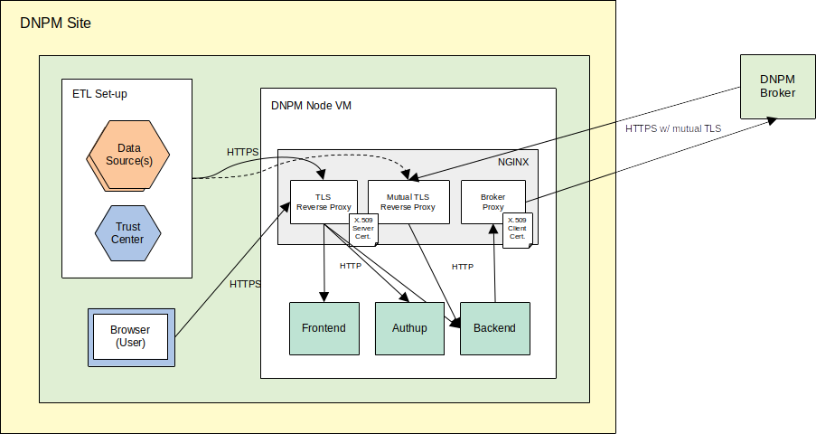

# DNPM:DIP - Deployment/Operation Instructions

> 🚧 **Work in Progress**

## Pre-requisites

* Docker / Docker Compose

### Certificates

* DFN Server Certificate issued for your DNPM:DIP node's FQDN
* Client Certificate issued by DNPM CA (see [here](https://ibmi-ut.atlassian.net/wiki/spaces/DAM/pages/2590714/Zertifikat-Verwaltung#Zertifikat-Verwaltung-BeantragungeinesClient-Zertifikats) for instructions to request one)


## System Overview




## Set-up

### Docker Compose

A template [`docker-compose.yml`](https://github.com/KohlbacherLab/dnpm-dip-deployment/blob/master/docker-compose.yml) is available.

Basic configuration occurs via environment variables, for most of which default values are pre-defined.
The only _mandatory_ variables are 

| Variable               | Use/Meaning                                                                                                                                                                                                            |
|------------------------|------------------------------------------------------------------------------------------------------------------------------------------------------------------------------------------------------------------------|
| `BASE_URL`             | The base URL to your local DNPM:DIP node. In a production set-up, the hostname of (reverse) proxy behind which the components run (see below). In a (local) development/test set-up possibly `http://localhost`        |
| `BACKEND_LOCAL_SITE`   | Your Site, in format `{Site-ID}:{Site-name}`, e.g. `UKT:Tübingen` (see [here](https://ibmi-ut.atlassian.net/wiki/spaces/DAM/pages/2613900/DNPM+DIP+-+Broker-Verbindungen) for the overview list of Site IDs and names) |


**TODO for You**: Provide these variables via a file `.env` in the same folder (see also [here](https://docs.docker.com/compose/environment-variables/set-environment-variables/)). Here's a sample:

```bash
BACKEND_LOCAL_SITE=UKx:SiteName
BASE_URL=https://dnpm.uni-x.de
```

If desired, the following variables CAN be set in the `.env` file to override the default values set in the `docker-compose.yml`:

| Variable                  | Use/Meaning                                                                                       |
|---------------------------|---------------------------------------------------------------------------------------------------|
| `AUTHUP_SECRET`           | Secret (password) of the Authup Admin user                                                        |
| `MYSQL_ROOT_PASSWORD`     | Password of the MySQL DB used in Authup                                                           |
| `BACKEND_CONNECTOR_TYPE`  | Set to one of { `broker`, `peer2peer` } to specify the desired connector type (see below)         | 
| `BACKEND_AUTHUP_URL`      | Base URL under which the Backend can reach Authup                                                 |  
| `BACKEND_RD_RANDOM_DATA`  | Set to a positive integer to activate in-memory generation of RD random data (for test purposes)  |
| `BACKEND_MTB_RANDOM_DATA` | Set to a positive integer to activate in-memory generation of MTB random data (for test purposes) |


### Reverse/Forward Proxy

As shown in the system overview diagram above, the backend and frontend components are meant to be operated behind a reverse proxy.
This handles TLS termination (including mutual TLS for API endpoints not secured by a login mechanism) and also acts as a forward proxy
to handle the client certificate for mutual TLS on outgoing requests (see below about the Backend Connector).

The default/recommended set-up uses NGINX, for which a template configuration file [`nginx_tls.conf`](https://github.com/KohlbacherLab/dnpm-dip-deployment/blob/master/nginx_tls.conf) is available.

**TODOs for You**: 

* In`docker-compose.yml` service `nginx`, adapt the paths to the respective certificate and private key files.
* In `nginx_tls.conf` Adapt the URL to the Broker in the `server` block acting as forward proxy to the Broker. 


### Backend

The following components/functions of the backend are configured via external configuration files.
Templates for these are available [here](https://github.com/KohlbacherLab/dnpm-dip-deployment/tree/master/backend-config).
These files are expected by the application in the directory bound to docker volume `/dnpm_config` in `docker-compose.yml`.

**TODOs for You**:

- In `docker-compose.yml`: Bind the directory to contain config files to `backend` service volume `/dnpm_config`
- Place files [`production.conf`](https://github.com/KohlbacherLab/dnpm-dip-deployment/blob/master/backend-config/production.conf),[`logback.xml`](https://github.com/KohlbacherLab/dnpm-dip-deployment/blob/master/backend-config/logback.xml),[`config.xml`](https://github.com/KohlbacherLab/dnpm-dip-deployment/blob/master/backend-config/config.xml) into this config directory


#### Play HTTP Server

The Play HTTP Server in which the backend application runs is configured via file [`production.conf`](https://github.com/KohlbacherLab/dnpm-dip-deployment/blob/master/backend-config/production.conf).
The template provides defaults for all required settings. In case the backend won't be addressed via a reverse proxy forwarding to 'localhost' (see below) but directly by IP and/or hostname, these "allowed hosts" must be configured explicitly:

```bash
...
hosts {
  allowed = ["your.host.name",...]
}
```
See also the [Allowed Hosts Filter Documentation](https://www.playframework.com/documentation/3.0.x/AllowedHostsFilter).
Depending on the size of upload request payload, the size of the memory buffer might also have to be adjusted here:

```bash
http.parser.maxMemoryBuffer=2MB
```

#### Persistence

Data persistence by the backend uses the file system. 

**TODO for You**: In `docker-compose.yml`, bind the directory meant for this purpose to the `backend` service's docker volume `/dnpm_data`. 

Depending on the permission set on this directory, you might have to explicitly set the system user ID for the docker process running the backend (see `services.backend.user` in `docker-compose.yml`).


#### Logging

Logging is based on [SLF4J](https://slf4j.org/).
The SLF4J implementation plugged in by the Play Framework is [Logback](https://logback.qos.ch/), which is configured via file [`logback.xml`](https://github.com/KohlbacherLab/dnpm-dip-deployment/blob/master/backend-config/logback.xml).
The default settings in the template define a daily rotating log file stored in sub-folder `/logs` of the docker volume bound for persistence (see above).

You might consider removing/deactivating the logging [appender to STDOUT](https://github.com/KohlbacherLab/dnpm-dip-deployment/blob/master/backend-config/logback.xml#L30)


#### Application Config

The Backend application itself is configured via [`config.xml`](https://github.com/KohlbacherLab/dnpm-dip-deployment/blob/master/backend-config/config.xml).
The main configuration item there is the type of Connector used for communication with external DNPM:DIP node peers.

This file's template shows example configurations for both possible connector types described below.

**TODO for You**: Delete the one _not_ applicable to your case, and follow respective instructions below.

##### Broker Connector

The connector for the hub/spoke network topology used in DNPM, based on a central broker accessed via a local Broker Proxy (see below).
The connector performs "peer discovery" by fetching the list of external peers from the central broker.
If desired, you can override the request time-out (seconds).
Also, in case you prefer the nector to periodically update its "peer list", instead of just once upon start-up, set the period (minutes).


##### Peer-to-peer Connector

The connector based on a peer-to-peer network topology, i.e. with direct connections among DNPM:DIP nodes. Accordingly, each external peer's Site ID, Name, and BaseURL must be configured in a dedicated element, as shown in the template.


